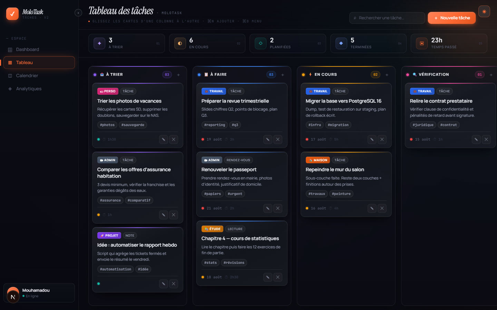
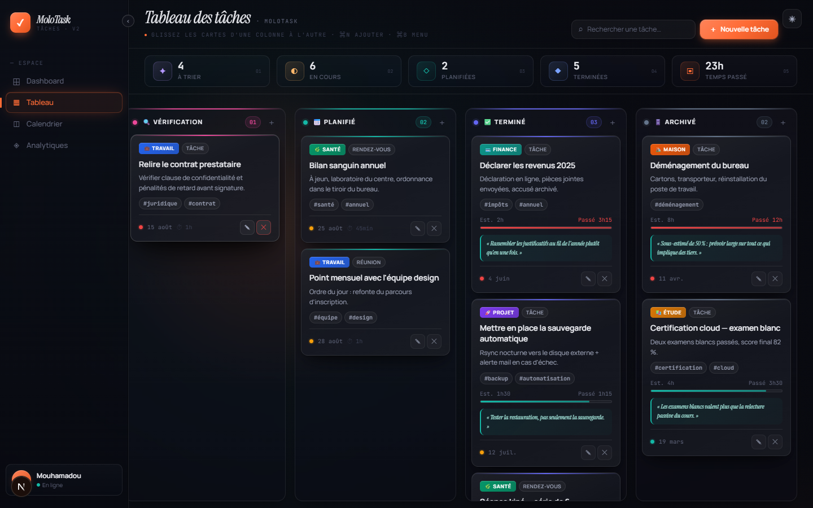

[← Sommaire](README.md) · Suivant : [Créer et modifier une tâche →](02-taches.md)

# 1. Tableau des tâches

L'écran principal, ouvert par défaut. Il montre toutes les tâches réparties dans les
sept colonnes du cycle de vie.

## La barre du haut

- **Titre + rappel** — sous le titre, la ligne grise rappelle les gestes disponibles
  (glisser une carte, `⌘N`, `⌘B`).
- **Recherche** — filtre les cartes au fur et à mesure de la frappe.
- **＋ Nouvelle tâche** — ouvre la modale de création, la tâche atterrit dans `À trier`.
- **Bouton icône ☀ / ☾** (coin supérieur droit) — bascule le thème clair / sombre.

## La barre de statistiques

Cinq compteurs recalculés à chaque changement :

| Compteur | Ce qu'il additionne |
|---|---|
| **À trier** | les tâches de la colonne `À trier` |
| **En cours** | les colonnes `À faire`, `En cours` et `Vérification` |
| **Planifiées** | la colonne `Planifié` |
| **Terminées** | les colonnes `Terminé` et `Archivé` |
| **Temps passé** | la somme des temps réellement consommés |

## Les colonnes

Chaque colonne a sa teinte propre (liseré supérieur, pastille, compteur) : violet pour
`À trier`, bleu pour `À faire`, ambre pour `En cours`, rose pour `Vérification`,
turquoise pour `Planifié`, indigo pour `Terminé`, gris pour `Archivé`.

- Le compteur affiche le nombre de cartes de la colonne (`03`, `01`…).
- Le **＋** de l'en-tête crée une tâche directement dans cette colonne.
- Une colonne vide affiche une zone en pointillés avec son intention
  (« prêt à démarrer », « travail en cours », « relecture, validation, attente
  retour »…) ; cliquer dessus crée une tâche dans la colonne.

## Une carte

Une carte porte, de haut en bas : la catégorie et le type, le titre, la description,
les tags, puis un pied avec la priorité (pastille colorée), l'échéance et le temps
estimé. Au survol apparaissent **✎ Modifier** et **✕ Supprimer**.

## Déplacer une tâche

Les cartes se glissent d'une colonne à l'autre. Pendant le glisser :

- la carte d'origine devient translucide et légèrement inclinée ;
- la colonne survolée s'illumine avec un liseré orange en pointillés ;
- si le pointeur s'approche d'un bord du tableau, **le tableau défile tout seul** —
  utile pour envoyer une carte de `À trier` vers `Archivé` sans lâcher la souris.

## Faire défiler le tableau

Sept colonnes ne tiennent pas dans une fenêtre : le tableau défile horizontalement.

- **Molette** — fait défiler le tableau vers la droite ou la gauche. Si le pointeur
  survole une colonne dont la liste de cartes peut encore défiler verticalement, la
  molette sert d'abord à cette colonne, puis reprend le défilement horizontal une fois
  la liste au bout.
- **Maj + molette** — force le défilement horizontal, même au-dessus d'une liste.
- **Barre de défilement** — sous le tableau, plus épaisse et plus facile à saisir ;
  celle d'une colonne n'apparaît qu'au survol de la colonne.

## Les colonnes de fin

Dans `Terminé` et `Archivé`, les cartes affichent en plus :

- une **barre estimé / passé** — la barre vire à l'orange quand le temps consommé
  dépasse l'estimation ;
- la **rétrospective**, en italique sur fond turquoise : ce que la tâche a appris.

---

[← Sommaire](README.md) · Suivant : [Créer et modifier une tâche →](02-taches.md)
