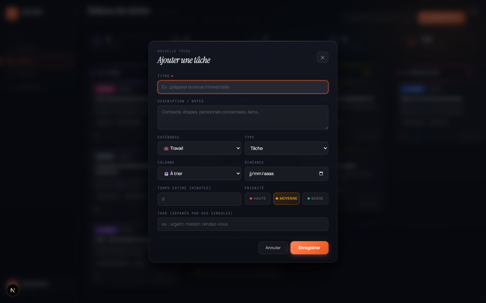
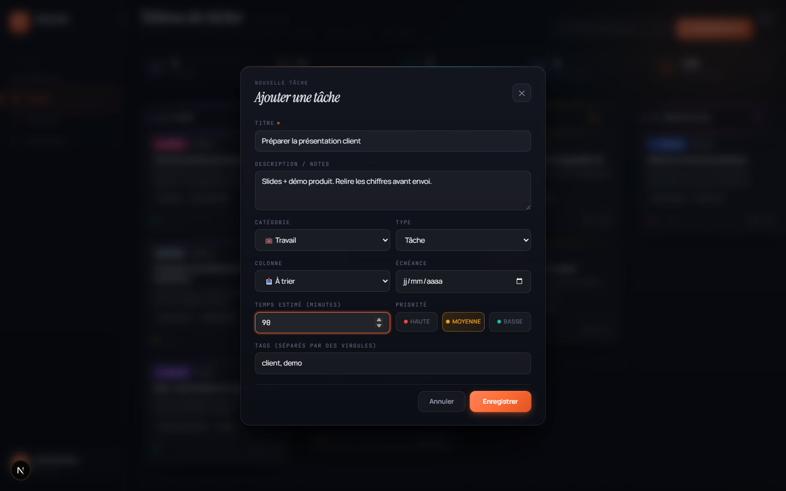
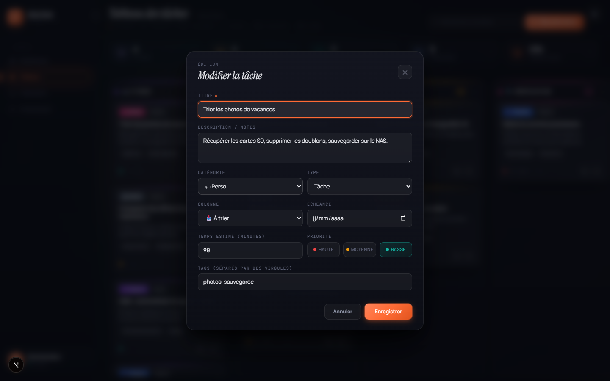
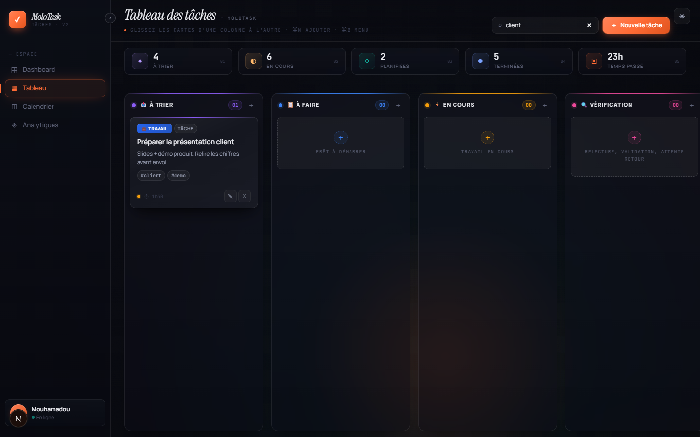

[← Tableau](01-tableau.md) · [Sommaire](README.md) · Suivant : [Dashboard →](03-dashboard.md)

# 2. Créer et modifier une tâche

## Ouvrir la modale

Trois chemins : le bouton **＋ Nouvelle tâche** de la barre du haut, le **＋** d'une
colonne (la tâche est pré-affectée à cette colonne), ou le raccourci `Ctrl` / `⌘` + `N`.

## Les champs

| Champ | Rôle |
|---|---|
| **Titre** ✱ | Seul champ obligatoire — enregistrer sans titre signale le champ en erreur et y ramène le focus |
| **Description / notes** | Contexte, étapes, personnes concernées, liens |
| **Catégorie** | Travail, Perso, Projet, Admin, Étude, Maison, Santé, Finance… — donne sa couleur au badge de la carte |
| **Type** | Tâche, Note, Rendez-vous, Réunion, Lecture… |
| **Colonne** | Où la carte atterrit dans le tableau |
| **Échéance** | Date affichée dans le pied de carte, dans le calendrier et dans « À venir » du dashboard |
| **Temps estimé (minutes)** | Base de comparaison avec le temps réellement passé |
| **Priorité** | `Haute` (rouge), `Moyenne` (ambre) ou `Basse` (turquoise) |
| **Tags** | Séparés par des virgules ; affichés en `#tag` et pris en compte par la recherche |

La modale piège le focus : `Tab` circule dans le formulaire, `Échap` ferme sans
enregistrer, et le champ *Titre* est sélectionné à l'ouverture.

## Le résultat

Après *Enregistrer*, la carte apparaît en bas de la colonne choisie et les compteurs
se mettent à jour — ici `À trier` passe de 3 à 4.

## Modifier

Le bouton **✎** d'une carte rouvre la même modale, pré-remplie, avec le titre
« Modifier la tâche ». Changer la **colonne** depuis ce formulaire déplace la carte —
alternative au glisser-déposer.

Dès que la **colonne** choisie est `Terminé` ou `Archivé`, trois champs
supplémentaires apparaissent en bas du formulaire : le **temps réellement passé**,
**ce qui a marché / ce qu'il faut changer** (la rétrospective affichée sur la carte)
et des **notes** (méthode, outils, blocages).

## Supprimer

Le bouton **✕** demande confirmation, puis retire la tâche définitivement. Pour garder
une trace d'une tâche finie sans encombrer le tableau, la déplacer dans `Archivé`
plutôt que la supprimer.

## Rechercher

Le champ de recherche filtre en direct sur le **titre**, la **description** et les
**tags**. Les colonnes conservent leur place et affichent leur nombre de résultats —
ici, `client` ne remonte qu'une carte.

Vider le champ rétablit l'ensemble des tâches.

---

[← Tableau](01-tableau.md) · [Sommaire](README.md) · Suivant : [Dashboard →](03-dashboard.md)
