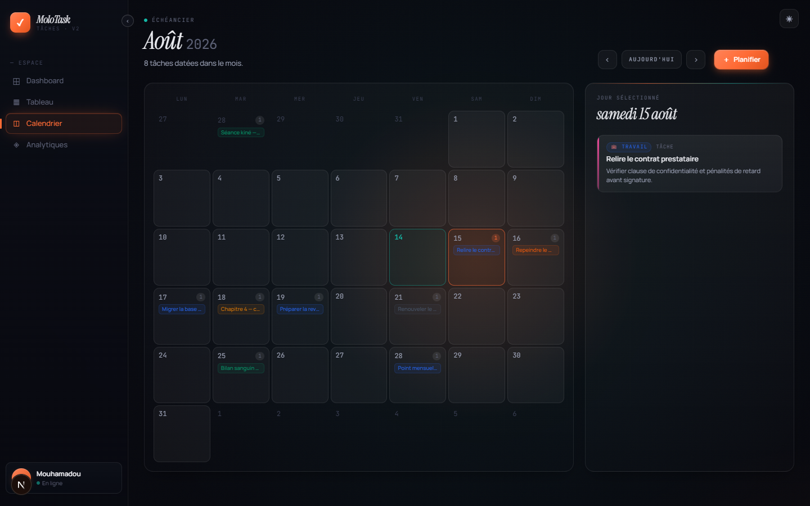

[← Dashboard](03-dashboard.md) · [Sommaire](README.md) · Suivant : [Analytiques →](05-analytiques.md)

# 4. Calendrier

Les échéances posées sur une grille mensuelle. Menu de gauche : **◫ Calendrier**.

## La grille

- Semaine du **lundi au dimanche** ; les jours des mois voisins restent visibles, en
  grisé.
- La case du **jour courant** est cerclée d'orange.
- Chaque case liste les tâches datées de ce jour, avec la teinte de leur colonne, et
  un compteur en haut à droite quand il y en a plusieurs.
- La case **sélectionnée** est mise en avant ; ici, le 15 août.

## Navigation

À droite du titre : **‹** mois précédent, **›** mois suivant, **Aujourd'hui** revient
au mois courant. Le sous-titre indique combien de tâches sont datées dans le mois
affiché. **＋ Planifier** crée une tâche directement dans la colonne `Planifié`.

## Le détail du jour

Le panneau de droite montre le jour sélectionné et ses tâches — catégorie, type,
titre, description. Cliquer une tâche l'ouvre en édition, ce qui permet de changer sa
date sans quitter la vue.

Un jour sans tâche affiche **Aucune tâche ce jour** et un raccourci
**＋ Planifier une tâche** qui pré-remplit la date.

> Seules les tâches ayant une **échéance** apparaissent ici. Une tâche sans date ne
> figure que dans le tableau.

---

[← Dashboard](03-dashboard.md) · [Sommaire](README.md) · Suivant : [Analytiques →](05-analytiques.md)
