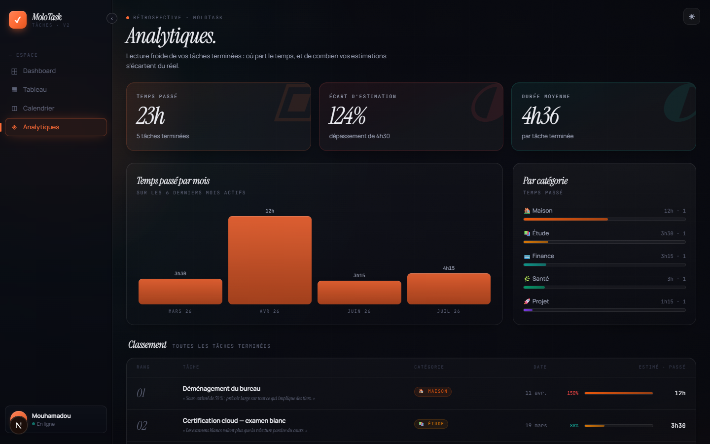

[← Calendrier](04-calendrier.md) · [Sommaire](README.md) · Suivant : [Thème, menu et raccourcis →](06-interface.md)

# 5. Analytiques

La rétrospective : où part le temps, et de combien les estimations s'écartent du réel.
Menu de gauche : **◈ Analytiques**.

> Cette vue ne regarde que les tâches **terminées ou archivées** — les seules qui
> portent un temps réellement passé. Sans tâche terminée, l'écran affiche un état vide.

## Les trois chiffres du haut

| Bloc | Lecture |
|---|---|
| **Temps passé** | Total consommé, et le nombre de tâches terminées derrière ce total |
| **Écart d'estimation** | `passé / estimé`. Au-dessus de 100 %, on a dépassé — la ligne du dessous chiffre le dépassement (« dépassement de 4h30 ») |
| **Durée moyenne** | Temps moyen par tâche terminée |

## Temps passé par mois

Barres sur les six derniers mois actifs, chacune étiquetée par sa durée. Les mois sans
tâche terminée sont ignorés, ce qui évite les trous dans le graphique.

## Par catégorie

Le temps consommé par domaine, en barres classées de la plus lourde à la plus légère,
avec la durée et le nombre de tâches (`12h · 1`). C'est la réponse à « qu'est-ce qui
mange mes semaines ».

## Classement

Le tableau du bas liste toutes les tâches terminées, de la plus longue à la plus
courte : rang, titre, rétrospective en italique, catégorie, date de fin, écart
d'estimation en pourcentage, barre estimé / passé et temps final.

Le pourcentage se lit comme les blocs du haut : `150 %` signifie une tâche qui a pris
la moitié de temps en plus que prévu, `88 %` une tâche finie en avance. Cliquer une
ligne ouvre la tâche.

---

[← Calendrier](04-calendrier.md) · [Sommaire](README.md) · Suivant : [Thème, menu et raccourcis →](06-interface.md)
