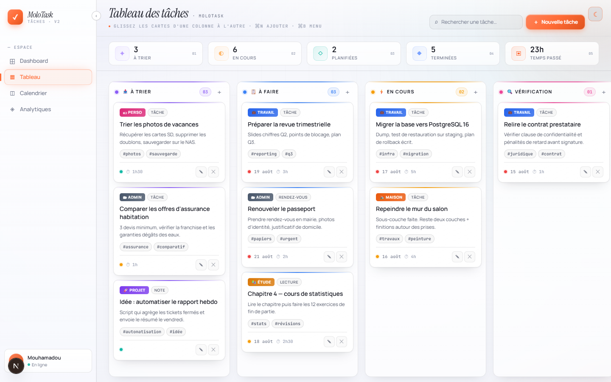
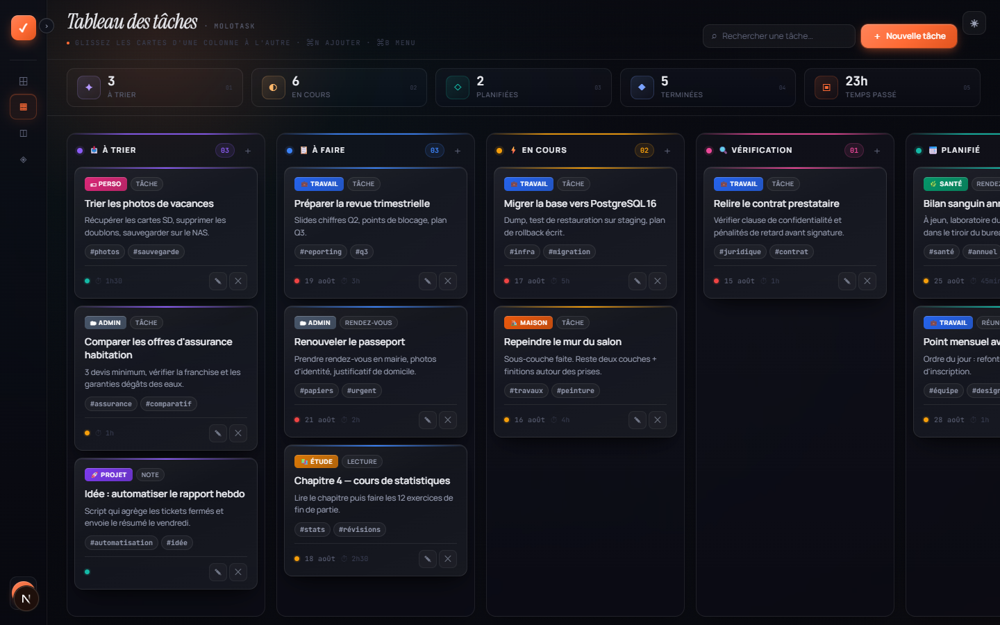

[← Analytiques](05-analytiques.md) · [Sommaire](README.md)

# 6. Thème, menu et raccourcis

## Thème clair / sombre

La bascule est le **bouton icône en haut à droite** de l'écran, présent sur les quatre
vues. Il affiche le thème vers lequel il fait basculer : **☀** en thème sombre,
**☾** en thème clair.

| Sombre | Clair |
|---|---|
|  |  |

Le choix est enregistré (`molotask_theme`) et réappliqué avant le premier rendu, donc
pas de flash blanc au rechargement. Les couleurs de catégorie et l'orange d'accent
restent identiques dans les deux thèmes ; seules les surfaces, les textes et les
couleurs d'état changent.

## Menu latéral repliable

Le **chevron** posé sur le bord droit du menu (`‹` / `›`) replie la barre de 228 px à
68 px. Le raccourci `Ctrl` / `⌘` + `B` fait la même chose.

Replié, le menu ne garde que le logo, les quatre icônes de navigation et l'avatar ;
le libellé de chaque entrée s'affiche en infobulle au survol. Le gain se voit sur le
tableau : deux colonnes de plus tiennent à l'écran.

L'état est enregistré (`molotask_sidebar`) et retrouvé au prochain lancement.

## Navigation

Les quatre entrées du menu — **Dashboard**, **Tableau**, **Calendrier**,
**Analytiques** — changent la vue sans recharger la page. L'entrée active est marquée
en orange, avec un liseré à gauche. Le logo MoloTask ramène au Dashboard.

## Raccourcis clavier

| Raccourci | Action |
|---|---|
| `Ctrl` / `⌘` + `N` | Nouvelle tâche (colonne `À trier`) |
| `Ctrl` / `⌘` + `B` | Replier / déplier le menu |
| `Échap` | Fermer la modale ouverte |
| `Tab` | Circuler dans les champs de la modale (le focus reste piégé dedans) |

## Gestes de défilement

| Geste | Effet |
|---|---|
| Molette au-dessus d'une liste de cartes | Fait défiler la colonne, tant qu'elle n'est pas au bout |
| Molette au-dessus du tableau | Fait défiler les colonnes horizontalement |
| `Maj` + molette | Force le défilement horizontal |
| Glisser une carte vers un bord | Le tableau défile tout seul dans cette direction |

---

[← Analytiques](05-analytiques.md) · [Sommaire](README.md)
